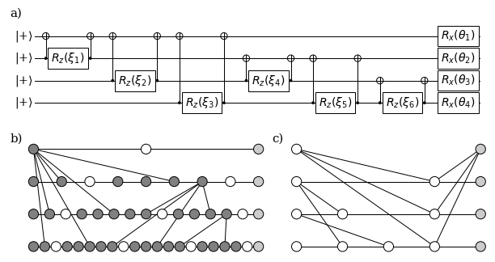

Graphix demo
============

Simple QAOA
-----------

Simple QAOA circuit for max-cut of complete graph with four nodes

.. code-block:: python

    from graphix import Circuit
    import networkx as nx
    import numpy as np
    n=4
    xi = np.random.rand(6)
    theta = np.random.rand(4)
    g = nx.complete_graph(n)
    circuit = Circuit(n)
    for i, (u,v) in enumerate(g.edges):
        circuit.cnot(u, v)
        circuit.rz(v, xi[i])
        circuit.cnot(u, v)
    for v in g.nodes:
        circuit.rx(v, theta[v])
    pattern = circuit.transpile()
    pattern.standardize()
    pattern.shift_signals()
    pattern.perform_pauli_measurements()
    pat.minimize_space()
    out_state = pattern.simulate_pattern()

The corresponding circuit is shown in (a) and graph state before and after :meth:`~graphix.Pattern.perform_pauli_measurements` can be seen in (b) and (c).
The size (number of nodes) of the graph state to perform the computation changes from over 50 to 15.

