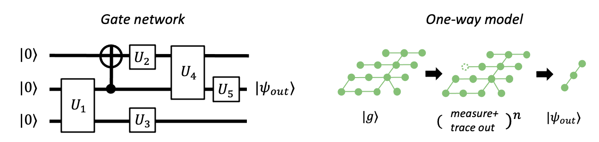
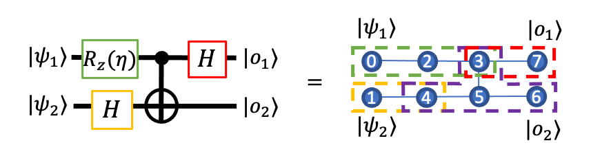

Introduction to MBQC
====================

Here, we provide an introduction to the measurement-based quantum computing (MBQC), more specifically the one-way model of MBQC.

If you already know the basics of MBQC and would like to read about LC-MBQC (MBQC on local-Clifford decorated graph state), go to :doc:`lc-mbqc`. We assume basic understanding of quantum mechanics. Backens et al. [#backens]_ includes the general framework of MBQC with LC-decorated graph states, on which the idea of pattern-based MBQC with LC is based on.

For those new to quantum mechanics and quantum information, `qiskit provides a nice introduction <https://qiskit.org/textbook/ch-states/introduction.html>`_ (chapters 0-2 of the their textbook would be sufficient to understand our introduction here).

Introduction
------------

| Quantum computing utilizes entanglement to accelerate the computation of some class of problems, such as the `prime factorization <https://en.wikipedia.org/wiki/Shor%27s_algorithm>`_.
| Quantum algorithms are very often expressed in the `gate network` model, which is a direct analog of the classical computers expressed in the network of logical bit operations (AND, OR, XOR, ...).
| The familiar quantum `circuits` thus express the time evolution of quantum bits (qubits) as they 'pass through' the quantum version of the logical operation.
| Here, the entanglement, which is arguably the source of the power of quantum computing, is created and destroyed continuously - in a very crude way, this means that we don't intuitively know where the `quantum` comes in [#gktheorem]_.

.. figure:: ./../imgs/classical.png
   :scale: 50 %
   :align: center
   :alt: quantum and classical processing

Measurement-based (one-way) quantum computing, introduced by Raussendorf [#raussendorf]_, has a different approach which can be called `consumption of initially entangled resource state`; first you create a large entangled quantum state (graph state :math:`|g\rangle`), and the computation goes by measurements of qubits which drives the evolution of the quantum state. Entanglement is only required at the start, and all subsequent operations only reduce entanglement.

MBQC has several remarkable advantages that may motivate us to study further:

- Only single-qubit measurements are needed to perform the computation on the resource state.
- The resource state can be prepared in a depth of one using CZ gates which commute with each other. Further, they can be prepared offline, and/or can be based on probabilistic entangling operations.
- The depth of the computation is usually significantly smaller than the equivalent quantum circuit, which means computation might be less affected by finite coherence time.

One-way quantum computing
-------------------------

In one-way model, we perform quantum computation on the `resource state`, or equivalently the `graph state <https://en.wikipedia.org/wiki/Graph_state>`_, defined on mathematical graph :math:`G = (N, E)` where :math:`N` is the set of nodes (qubits) and :math:`E` is a set of pairs of node indices, specifying graph edges, by

.. math::

    \begin{equation}
    |g\rangle = \prod_{(i,j) \in E} CZ_{i,j} \bigotimes_{i\in N} |+\rangle_i, \label{1}   \tag{1}
    \end{equation}

where :math:`\bigotimes_{i\in N} = |+\rangle_{i_1}\otimes|+\rangle_{i_2} \otimes cdots`, tensor product of :math:`|+\rangle` states.
A simplest example is the graph state with two qubits, :math:`|g'\rangle = CZ_{0,1}|+\rangle_1 \otimes |+\rangle_0`, which is local-unitary equivalent to the Bell state.

Measurement of a qubit in Pauli X basis is expressed by the application of one of projection operators corresponding to measurement outcome :math:`(-1)^s = -1` or :math:`1` for :math:`s=0, 1` ,

.. math::

    \begin{equation}
    P_{X, s=0} = |+\rangle \langle+|, \ \ P_{X, s=1} = |-\rangle \langle-|. \label{2}   \tag{2}
    \end{equation}

Since measurements can be considered destructive, we can trace out (partial trace) the measured qubits and  the application of bras (:math:`\langle+|, \langle-|`) is sufficient.
For our simplest graph state :math:`|g'\rangle`, measurement of qubit 0 in the X bases gives

.. math::

    \begin{align}
    |g_{s=0}\rangle &= \langle+|_0 CZ_{0,1}|+\rangle_1 \otimes |+\rangle_0 = H|+\rangle_1,\ \ s = 0, \label{3}   \tag{3} \\
    |g_{s=1}\rangle &= \langle-|_0 CZ_{0,1}|+\rangle_1 \otimes |+\rangle_0 = XH|+\rangle_1, \ \ s = 1. \label{4}   \tag{4}
    \end{align}

If the measurement outcome was :math:`s=0`, the output state is the initial :math:`|+\rangle` state with a Hadamard gate applied. If :math:`s=1`, there is additional :math:`X` gate applied. \
In fact, this process of entangling with another qubit and then measuring with X basis the original qubit (qubit 0) is the MBQC version of Hadamard gate, and we treat the randomness of the measurement outcome with feedforward operations, as we describe below.

In MBQC, measurements with :math:`s=0` is to be considered `default` outcome, and the additional :math:`X` term is called `byproduct` of the measurement stemming from the other result :math:`s=1`. The simplest construction of MBQC would be to apply adaptive :math:`X` gate to `correct` for this byproduct, which we can express as follows

.. math::

    \begin{equation}
    H|+\rangle_1 = X^{s_0} \langle\pm|_0 CZ_{0,1}|+\rangle_1 \otimes |+\rangle_0,  \label{5}   \tag{5}
    \end{equation}

where :math:`X^{s_0}` is applied if the measurement outcome of qubit 0 is :math:`s_0=1`.
Another way to treat the byproduct is by rotating the subsequent measurements. In quantum hardware, we always end the quantum algorithm with computational (:math:`Z`) basis measurements - so for output qubits with :math:`X` byproduct applied (for this case, if :math:`s_0=1`), we can simply swap the measurement result between 0 and 1 (recall that Pauli :math:`X` gate can be considered analogue of classical NOT for computational bases).

This works also for arbitrary input state in qubit 0, :math:`|\psi\rangle = \alpha|0\rangle + \beta|1\rangle`. In this case,

.. math::

    \begin{equation}
    H|\psi_{in}\rangle_1 = X^{s_0} \langle\pm|_0 CZ_{0,1}|+\rangle_1 \otimes |\psi_{in}\rangle_0,  \label{6}   \tag{6}
    \end{equation}

which can be easily checked. notice that the input quantum state in qubit 0 has teleported to qubit 1 while being rotated by Hadamard gate.

Most basic quantum gates (unitary operations) have corresponding graph state and a sequence of measurements and byproduct corrections, as we show below.

.. math::

    \begin{align}
        CNOT_{0,3}|\psi_{in}\rangle_{03} = X_3^{s_2} Z_3^{s_1} Z_0^{s_1} \langle\pm|_2 \langle\pm|_1 CZ_{0,2} CZ_{2,3} CZ_{1,2} |+\rangle_3 |+\rangle_2 |\psi_{in}\rangle_{01},  \label{7}   \tag{7} \\
        R_x(\theta)|\psi_{in}\rangle_2 = Z_2^{s_0} X_2^{s_1} \langle\pm_{(-1)^{1+s_0} \theta}|_1 \langle\pm|_0 CZ_{1,2} CZ_{0,1}|+\rangle_2 |+\rangle_1 |\psi_{in}\rangle_0,  \label{8}   \tag{8} \\
        R_z(\theta)|\psi_{in}\rangle_2 = Z_2^{s_0} X_2^{s_1} \langle\pm|_1 \langle\pm_{- \theta}|_0 CZ_{1,2} CZ_{0,1}|+\rangle_2 |+\rangle_1 |\psi_{in}\rangle_0,  \label{9}   \tag{9} \\
    \end{align}

where :math:`|\pm_{\theta}\rangle` are the bases for measurements along the axis rotated on XY plane by angle :math:`\theta` and :math:`\langle\pm_{(-1)^{1+s_0} \theta}|_1` is called `feedforward` measurement whose angle :math:`(-1)^{1+s_0} \theta` is dependent on the measurement outcome of qubit :math:`0`.
Because these building blocks include the single-qubit rotation and CNOT gate, MBQC is universal (i.e. with MBQC, we can deterministically realize `any` multi-qubit unitary operations). Particularly, note that Clifford gates can be translated into MBQC with no non-Pauli measurements (see eqs (:math:`\ref{6}`, :math:`\ref{7}`) for :math:`H`, :math:`S` and :math:`CNOT` gates, which generate any multi-qubit Clifford operations).

We can concatenate them to create a larger graph state that realizes a more complex unitary evolution we show below,

which we can express by a long sequence,

.. math::

    \begin{align}
        H_7 \ CNOT_{6,7} \ H_6 \ R_z(\eta)_7 \ |\psi_{in}\rangle_{74} =& X_7^{s_3} \langle\pm|_3 CZ_{37} |+\rangle_7 \otimes \big(  \\
        & X_6^{s_5} Z_6^{s_4} Z_3^{s_4} \langle\pm|_5 \langle\pm|_4 CZ_{56 } CZ_{45} CZ_{35} |+\rangle_5 |+\rangle_6 \otimes \big( \\
        & X_4^{s_1} \langle\pm|_1 CZ_{14} |+\rangle_4 \otimes \big( \\
        & Z_3^{s_0} X_3^{s_2} \langle\pm|_2 \langle\pm_{-\eta}|_0 CZ_{23} CZ_{02} |+\rangle_3 |+\rangle_2 \otimes |\psi_{in}\rangle_{01} \big)\big)\big).  \label{10}   \tag{10}
    \end{align}

Note that the input state has `teleported` to qubits 4 and 7 after the computation.

..
    We can inspect the graph state using :class:`~graphix.graphsim.GraphState` class:

    .. code-block:: python

        from graphix import GraphState
        g = GraphState(nodes=[0,1],edges=[(0,1)])

    >>> print(g.to_statevector())
    Statevec, data=[[ 0.5+0.j  0.5+0.j]
    [ 0.5+0.j -0.5+0.j]], shape=(2, 2)

Measurement Calculus
--------------------

It is quite tedious to treat the MBQC by bras and kets as we show in eqs (:math:`\ref{6}` - :math:`\ref{10}`) - it is impossible to track all the feedforwards and ancillas by hand if the number of operations grow as we try larger quantum algorithms.
Instead, we can resort to the `Measurement Calculus` [#mc]_ by Danos `et al.`, a mathematical formulation of MBQC, to treat them as a linear sequence of commands consisting of

.. list-table::
    :widths: 3 20
    :header-rows: 0

    * - :math:`N_i`
      - Node (qubit) preparation command with node index :math:`i`
    * - :math:`E_{ij}`
      - Entanglement command which apply :math:`CZ` gate to nodes :math:`(i,j)`
    * - :math:`{}^t[M_i^{ \lambda, \alpha}]^s`
      - | Measurement command which perform measurement of node :math:`i` with
        |   measurement plane :math:`\lambda =` XY, YZ or XZ,
        |   measurement angle :math:`\alpha` defined on the plane :math:`\lambda`,
        |   :math:`s` and :math:`t` feedforward domains that adaptively changes the measurement angles to
        |   :math:`\alpha' = (-1)^{q_s} \alpha + \pi q_t`,
        |   where :math:`q_s, q_t` are the sum of all measurement outcomes in the :math:`s` and :math:`t` domains.
    * - :math:`X_i^{s}`
      - byproduct command applied to qubit :math:`i` with signal domain :math:`s`
    * - :math:`Z_i^{s}`
      - byproduct command applied to qubit :math:`i` with signal domain :math:`s`
    * - :math:`C_i^{k}`
      - | Clifford command applied to qubit :math:`i` with single-qubit Clifford operator :math:`k`

where the Clifford command was added by us to treat the optimization routine we describe later in :doc:`lc-mbqc`.

We can now express the MBQC in eq (:math:`\ref{10}`) with these commands, which we read from the right:

.. math::

    X_7^{3} M_3^{0} E_{37} N_7 X_6^5 Z_6^4 Z_3^4 M_5^0 M_4^0 E_{56} E_{45} E_{35} N_6 N_5 X_4^1 M_1^0 E_{14} N_4 Z_3^0 X_3^2 M_2^0 M_0^{-\theta} E_{23} E_{02} N_3 N_2

This is an example of `measurement pattern` that realize MBQC. While this still looks long, this can now be treated programmatically, to efficiently handle with code and to optimize following well-defined rules.

The first optimization is the `standardization` which turns arbitrary measurement pattern into `standard` form which is sorted in the order of :math:`N`, :math:`E`, :math:`M` and then followed by a mix of :math:`X,Z,C`.
This can be done by following the command commutations rules described in the original paper [#mc]_.
This removes intermediate byproduct commands to create

.. math::

    \begin{align}
    X_6^5 X_7^3 Z_6^4 Z_7^2 {}^{[0,4]}[M_3^0]^2 \ \ {}^{[1,2]}[M_5^0] \ [M_4^0]^1 \ \ M_1^0 M_2^0 M_0^{-\theta} \\
    E_{02} E_{23} E_{14} E_{35} E_{45} E_{56} E_{37} N_7 N_6 N_5 N_4 N_3 N_2
    \end{align}

Further, `signal shifting` procedure [#mc]_ simplifies the measurement dependence, which removes all :math:`t` signals:

.. math::

    \begin{align}
    X_6^{1,2,5} X_7^{0,3,4} Z_6^{4} Z_7^{2} [M_3^0]^2 \ M_5^0 \ [M_4^0]^1 \ M_1^0 M_2^0 M_0^{-\theta} \\
     E_{02} E_{23} E_{14} E_{35} E_{45} E_{56} E_{37} N_7 N_6 N_5 N_4 N_3 N_2
    \end{align}

In the following page (:doc:`lc-mbqc`), we will further optimize the measurement pattern using efficient graph state simulator, to classically preprocess all Pauli measurements (all :math:`M` commands except qubit 0). This produce the following pattern:

.. math::

    \begin{align}
    X_7^0 C_6^6 M_0^{-\theta} E_{07} E_{06} N_7
    \end{align}

References and footnotes
------------------------

.. [#backens] Backens `et al.`, `Quantum 5, 421 (2021) <https://arxiv.org/abs/2003.01664>`_.

.. [#gktheorem] For example, we know that `a certain type of quantum gates are not so essential for quantum computations (efficiently simulatable on classical computers) <https://en.wikipedia.org/wiki/Gottesman%E2%80%93Knill_theorem>`_. However, in gate sequences these 'classical' parts are interleaved with 'quantum' parts of the algorithm. In fact, by translating the problem into MBQC, one can classically preprocess such a part - see :doc:`lc-mbqc`.

.. [#raussendorf] Raussendorf `et al.`, `PRL 86, 5188 (2001) <https://link.aps.org/doi/10.1103/PhysRevLett.86.5188>`_ and `PRA 68, 022312 (2003) <https://link.aps.org/doi/10.1103/PhysRevA.68.022312>`_. Here, by MBQC we refer to one-way quantum computing by Raussendorf among several measurement-based schemes.

.. [#mc] Danos `et al.`, `J. ACM 54.2 8 (2007) <https://arxiv.org/abs/0704.1263>`_ and `Chapter 7, "Semantic Techniques in Quantum Computation" <https://www.cambridge.org/core/books/abs/semantic-techniques-in-quantum-computation/extended-measurement-calculus/7DFCD85D9BA613B57B8935E3B57323BC>`_
