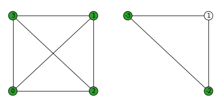
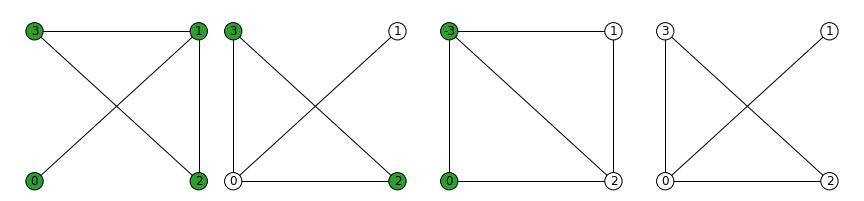
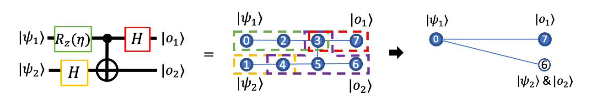

Introduction to LC-MBQC
=======================

In :doc:`intro`, we looked at how to generate and optimize MBQC command sequence to realize universal quantum computations. Here, we further optimize the measurement pattern to significantly reduce the number of operations required. For this, we use efficient graph simulator :class:`~graphix.graphsim.GraphState` which we explain below.
Note that this pattern simplification is very similar (and in fact a subset of) optimizations using `ZX calculus <https://zxcalculus.com/>`_; see for example, `this paper <https://arxiv.org/abs/2003.01664>`_.

Graph state simulator
---------------------
Graph states on mathematical graph :math:`G=(N, E)` are stabilizer states, defined by the set of stabilizers

.. math::
    S_i = X_i \bigotimes_{(i,j) \in E} Z_j, \ \ i \in N

and satisfies

.. math::
    |g\rangle = S_i |g\rangle, \ \ \forall i\in N.

This feature can be used to efficiently simulate the Clifford operations and Pauli measurements of graph states only by the change of stabilizers defining the states. Particularly, for graph states [#graph]_, these operations only cause the mathematical graph transformations and additional local-Clifford decorations [#el]_ after which the general form of the state is

.. math::
    \begin{equation}
    |g\rangle = \prod_{i\in\mathcal{H}_g} H_i \prod_{j\in\mathcal{S}_g} S_j \prod_{k\in\mathcal{Z}_g} Z_k \prod_{(l,m) \in E} CZ_{l,m} \bigotimes_{n\in N} |+\rangle_n, \label{1}   \tag{1}
    \end{equation}

where :math:`\mathcal{H}_g, \mathcal{S}_g, \mathcal{Z}_g` are the set of nodes with '`hollow`', '`loop`' and '`negative sign`' properties (decorations).
For example, let us try the transformation rules in Elliot `et al.` [#el]_ with a complete graph with four nodes (left). Measurement of qubit 0 in X basis, with measurement outcome :math:`s=0`, results in the graph on the right, with qubit 1 getting the '`hollow`' property (indicated by white node color) and qubits 2 and 3 getting the '`negative sign`' properties (indicated by negative signs of node labels).

We can perform this with :class:`~graphix.graphsim.GraphState` class and then compare to the :class:`~graphix.sim.statevec.Statevec` full statevector simulation:

.. code-block:: python

    from graphix import GraphState
    import networkx as nx
    import numpy as np
    from graphix.sim.statevec import meas_op

    # graphstate and statevector instance
    g = nx.complete_graph(4, create_using=GraphState)
    state = g.to_statevector()

    # measure qubit 0 in X basis, assume meas result s=0
    g.measure_x(0, choice=0)
    state_from_graphsim = g.to_statevector()

    # do the same with statevector sim
    state.evolve_single(meas_op(0, choice=0), 0)
    state.normalize()
    state.ptrace([0])

>>> print('overlap of states: ', np.abs(np.dot(state.flatten().conjugate(), state_from_graphsim.flatten())))
overlap of states:  1.0

So the graph state simulator returns a correct result.
Because this is not a full quantum state simulation, we can easily simulate `many` qubits without overloading memory. For example, we can simulate a million qubits on modest resource such as laptops:

.. code-block:: python

    from graphix import GraphState
    g = GraphState()
    g.add_nodes_from(i for i in range(int(1e6)))
    edges = [(i,i+1) for i in range(int(1e6-1))]
    g.add_edges_from(edges)
    g.measure_x(10000) # measure node with index 10000

Equivalent graphs
+++++++++++++++++

Furthermore, we can toggle through `equivalent graphs`, graph states with different underlying graphs and decorations representing exactly the same state. These four different graph states all represent same state, which we can check with the statevector simulator as shown below.

These graphs were generatetd using :class:`~graphix.graphsim.GraphState`, which has two methods to generate equivalent graphs, :meth:`~graphix.graphsim.GraphState.equivalent_graph_e1` and :meth:`~graphix.graphsim.GraphState.equivalent_graph_e2`, which have different conditions for applying them. For this graph, we can use :meth:`~graphix.graphsim.GraphState.equivalent_graph_e2` to any connected nodes since the graph is loopless.

.. code-block:: python

    # series of equivalent graph transformations
    g = GraphState(nodes=[0,1,2,3],edges=[(0,1),(1,2),(2,3),(3,1)]) # leftmost graph
    state1 = g.to_statevector()
    g.equivalent_graph_e2(0, 1) # second graph
    state2 = g.to_statevector()
    g.equivalent_graph_e2(2, 0) # third graph
    state3 = g.to_statevector()
    g.equivalent_graph_e2(0, 3) # rightmost graph
    state4 = g.to_statevector()

checking that states 1-4 all are the same up to global phase:

>>> print('overlap of states: ', np.abs(np.dot(state1.flatten().conjugate(), state2.flatten())))
overlap of states:  1.0
>>> print('overlap of states: ', np.abs(np.dot(state1.flatten().conjugate(), state3.flatten())))
overlap of states:  1.0
>>> print('overlap of states: ', np.abs(np.dot(state1.flatten().conjugate(), state4.flatten())))
overlap of states:  1.0

MBQC on local-Clifford decorated graph (LC-MBQC)
------------------------------------------------

Using the graph state simulator we described above, we can classically preprocess a large part of measurement pattern. For this, we need a few prerequisites:

#. We need to translate from measurement pattern to a graph state.
#. We need to make Pauli measurements independent from non-Pauli measurements
#. We need a way to translate the post-measurement state back into a measurement pattern that preserve determinism

1 and 2 can be treated by the original measurement calculus: graph state can be obtained by extracting the :math:`N` and :math:`E` commands, and 2 can be done by standardization and signal shifting procedure. 3 is possible by adding the Clifford commands to the command sequence, which merely change the measurement angles on the Bloch sphere, as well as careful consideration of feedforward signals.

We try this procedure with the measurement pattern in the last section (around the end of page :doc:`intro`),

The original measurement pattern that runs on the graph in the middle,

.. math::
    \begin{align}
    X_6^{1,2,5} X_7^{0,3,4} Z_6^{4} Z_7^{2} [M_3^0]^2 \ M_5^0 \ [M_4^0]^1 \ M_1^0 M_2^0 M_0^{-\theta} \\
     E_{02} E_{23} E_{14} E_{35} E_{45} E_{56} E_{37} N_7 N_6 N_5 N_4 N_3 N_2
    \end{align}

changes to significantly simplified one below, which runs on the graph on the right:

.. math::
    \begin{align}
    X_7^0 C_6^6 M_0^{-\theta} E_{07} E_{06} N_7
    \end{align}

Note that the input (we assume them to be :math:`|+\rangle`) qubit changed from [0, 1] to [0, 6].

References and notes
--------------------

.. [#graph] In fact, it is known that all stabilizer state can be represented by graph states up to local (single-qubit) Clifford operations.

.. [#el]  Elliot `et al`., `J. Phys. A 43, 025301 (2010) <https://iopscience.iop.org/article/10.1088/1751-8113/43/2/025301/meta>`_  and `PRA 77, 042307 (2008) <https://journals.aps.org/pra/abstract/10.1103/PhysRevA.77.042307>`_. We note that there are numerous stabilizer simulators available, but this graph simulator formulation by Elliot `et al.` is suitable for optimizing MBQC for three reasons: 1. this is a direct simulator of graph states, 2. the local-Clifford decoration is expressed by up to one H, S and Z gates, which are easier to handle than all 24 possible single-qubit Clifford gates, and 3. this has a method to toggle through all possible equivalent graphs (LC decorated graphs representing exactly the same stabilizer state), to minimize the connectivity of the graph state (to minimize the complexity of MBQC operation and classical simulation).
