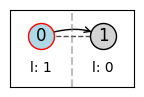
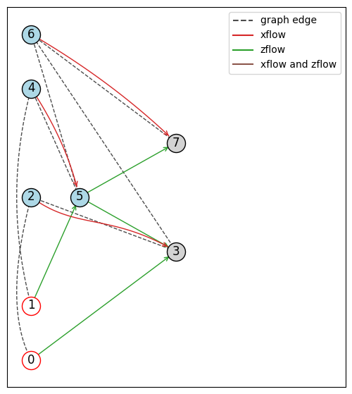
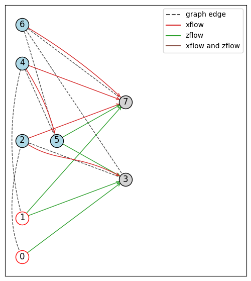
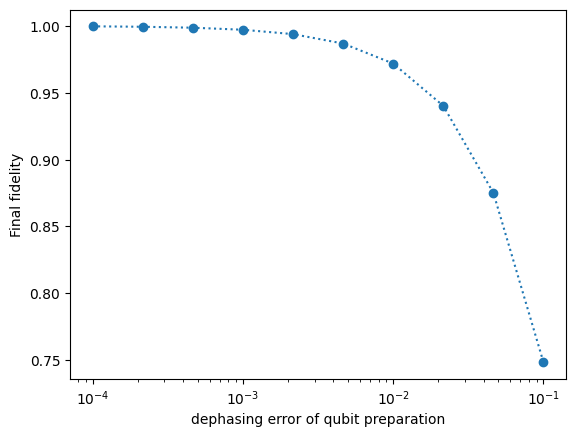

Tutorial
========

Graphix provides a high-level interface to generate, optimize and classically simulate the measurement-based quantum computing (MBQC).

In this tutorial, we look at how to program MBQC using graphix library.
We will explain the basics here along with the code, and you can go to :doc:`intro` to learn more about the theoretical background of MBQC and :doc:`references` for module references.

Generating measurement patterns
-------------------------------

Graphix is centered around the measurement *pattern*, which is a sequence of commands such as qubit preparation, entanglement and single-qubit measurement commands.
The most basic measurement pattern is that for realizing Hadamard gate, which we will use to see how *graphix* works.

First, install ``graphix`` by

>>> pip install graphix

For any gate network, we can use the :class:`~graphix.transpiler.Circuit` class to generate the measurement pattern to realize the unitary evolution.

.. code-block:: python

    from graphix.transpiler import Circuit
    # apply H gate to a qubit in + state
    circuit = Circuit(1)
    circuit.h(0)
    pattern = circuit.transpile().pattern

the :class:`~graphix.pattern.Pattern` object contains the sequence of commands according to the measurement calculus framework [#Danos2007]_.
Let us print the pattern (command sequence) that we generated,

>>> pattern
Pattern(input_nodes=[0], cmds=[N(1), E((0, 1)), M(0), X(1, {0})], output_nodes=[1])

The command sequence represents the following sequence:

    * starting with an input qubit :math:`|\psi_{in}\rangle_0`, we first prepare an ancilla qubit :math:`|+\rangle_1` with N(1) command
    * We then apply CZ-gate by E((0, 1)) command to create entanglement.
    * We measure the qubit 0 in Pauli X basis, by M(0) command.
    * If the measurement outcome is :math:`s_0 = 1` (i.e. if the qubit is projected to :math:`|-\rangle`, the Pauli X eigenstate with eigenvalue of :math:`(-1)^{s_0} = -1`), the 'X' command is applied to qubit 1 to 'correct' the measurement byproduct (see :doc:`intro`) that ensure deterministic computation.
    * Tracing out the qubit 0 (since the measurement is destructive), we have :math:`H|\psi_{in}\rangle_1` - the input qubit has teleported to qubit 1, while being transformed by Hadamard gate.

This MBQC pattern sequence uses a resource state as shown below:

.. figure:: ./../imgs/graphH.png
   :scale: 100 %
   :alt: resource state to perform computation

This is the simplest of the `graph state
<https://en.wikipedia.org/wiki/Graph_state>`_ with nodes = [0, 1] and edge = (0, 1). Any MBQC pattern has a corresponding resource graph state on which the computation occurs only with single-qubit measurements.

We can use the :class:`~graphix.simulator.PatternSimulator` to classically simulate the pattern above and obtain the output state, for default input state of :math:`|+\rangle`.
Alternatively, we can simply call :meth:`~graphix.pattern.Pattern.simulate_pattern` of :class:`~graphix.pattern.Pattern` object to do it in one line:

>>> print(pattern.simulate_pattern(backend='statevector'))
Statevec object with statevector [1.+0.j 0.+0.j] and length (2,).

Note again that we started with :math:`|+\rangle` state so the answer is correct.

We can use the in-built visualization tool to view the pattern,

>>> pattern.draw_graph()

Universal gate sets
-------------------

As a more complex example than above, we show measurement patterns and graph states for CNOT and single-qubit general rotation which makes MBQC universal:

+------------------------------------------------------------------------------+
| **CNOT**                                                                     |
+------------------------------------------------------------------------------+
|.. figure:: ./../imgs/graph_cnot.png                                          |
|   :scale: 100 %                                                              |
|   :alt: resource state                                                       |
|                                                                              |
|   control: input=0, output=0; target: input=1, output=3                      |
+------------------------------------------------------------------------------+
| >>> cnot_pattern                                                             |
| Pattern(cmds=[N(0), N(1), N(2), N(3), E((1, 2)), E((0, 2)), E((2, 3)), M(1), |
|     M(2), X(3, {2}), Z(3, {1}), Z(0, {1})], output_nodes=[0, 3])             |
+------------------------------------------------------------------------------+
| **general rotation (an example with Euler angles 0.2pi, 0.15pi and 0.1 pi)** |
+------------------------------------------------------------------------------+
|.. figure:: ./../imgs/graph_rot.png                                           |
|   :scale: 100 %                                                              |
|   :alt: resource state                                                       |
|                                                                              |
|   input = 0, output = 4                                                      |
+------------------------------------------------------------------------------+
|>>> euler_rot_pattern                                                         |
| Pattern(cmds=[N(0), N(1), N(2), N(3), N(4), M(0, angle=-0.2),                |
|     M(1, angle=-0.15, s_domain={0}), M(2, angle=-0.1, s_domain={1}),         |
|     M(3), Z(4, domain={0, 2}), X(4, domain={1, 3})], output_nodes=[4])       |
+------------------------------------------------------------------------------+

We can concatenate these commands to perform any quantum information processing tasks, which we will look at in more detail below.
Of course, we also have many other gates that can be transpiled into MBQC; see :class:`~graphix.transpiler.Circuit` class.

Optimizing patterns
-------------------------------
We provide a number of optimization routines to improve the measurement pattern.
As an example, let us prepare a pattern to rotate two qubits in :math:`|+\rangle` with a random angle and entangle them with a CNOT gate:

.. code-block:: python

    from graphix.transpiler import Circuit
    import numpy as np
    circuit = Circuit(2) # initialize with |+> \otimes |+>
    circuit.rz(0, np.random.rand())
    circuit.rz(1, np.random.rand())
    circuit.cnot(0, 1)
    pattern = circuit.transpile().pattern

This produces a rather long and complicated command sequence.

>>> pattern
Pattern(input_nodes=[0, 1], cmds=[N(2), N(3), E((0, 2)), E((2, 3)), M(0, angle=-0.08131311068764493), M(2), X(3, {2}), Z(3, {0}), N(4), N(5), E((1, 4)), E((4, 5)), M(1, angle=-0.2242107876075538), M(4), X(5, {4}), Z(5, {1}), N(6), N(7), E((5, 6)), E((3, 6)), E((6, 7)), M(5), M(6), X(7, {6}), Z(7, {5}), Z(3, {5})], output_nodes=[3, 7])

As we see below, we can simplify and optimize the pattern by calling various methods of :class:`~graphix.pattern.Pattern`.

Standardization and signal shifting
+++++++++++++++++++++++++++++++++++

The *standard* pattern is a pattern where the commands are sorted in the order of N, E, M, (X, Z, C) where X, Z and C commands in bracket can be in any order but must apply only to output nodes.
Any command sequence has a standard form, which can be obtained by the *standardization* algorithm in [#Danos2007]_ that runs in polynomial time on the number of commands.

An additional *signal shifting* procedure simplifies the dependence structure of the pattern to minimize the feedforward operations.
These can be called with :meth:`~graphix.pattern.Pattern.standardize` and :meth:`~graphix.pattern.Pattern.shift_signals` and result in a simpler pattern sequence.

>>> pattern.standardize()
>>> pattern.shift_signals()
>>> pattern
Pattern(input_nodes=[0, 1], cmds=[N(2), N(3), N(4), N(5), N(6), N(7), E((0, 2)), E((2, 3)), E((1, 4)), E((4, 5)), E((5, 6)), E((3, 6)), E((6, 7)), M(0, angle=-0.22152331776994327), M(2), M(1, angle=-0.18577010991028864), M(4), M(5, s_domain={4}), M(6), Z(3, {0, 1, 5}), Z(7, {1, 5}), X(3, {2}), X(7, {2, 4, 6})], output_nodes=[3, 7])

The command sequence is now simpler and note that the most byproduct commands now apply to output nodes (3, 7).
This reveals the graph structure of the resource state which we can inspect:

.. code-block:: python

    import networkx as nx
    nodes, edges = pattern.get_graph()
    g = nx.Graph()
    g.add_nodes_from(nodes)
    g.add_edges_from(edges)
    pos = {0: (0, 0), 1: (0, -0.5), 2: (1, 0), 3: (4, 0), 4: (1, -0.5), 5: (2, -0.5), 6: (3, -0.5), 7: (4, -0.5)}
    graph_params = {'node_size': 240, 'node_color': 'w', 'edgecolors': 'k', 'with_labels': True}
    nx.draw(g, pos=pos, **graph_params)

.. figure:: ./../imgs/graph.png
   :scale: 100 %
   :alt: resource state to perform computation

0 and 1 are the input nodes and 3 and 7 are the output nodes of this graph.

Performing Pauli measurements
+++++++++++++++++++++++++++++

It is known that quantum circuit consisting of Pauli basis states, Clifford gates and Pauli measurements can be simulated classically (see `Gottesman-Knill theorem
<https://en.wikipedia.org/wiki/Gottesman%E2%80%93Knill_theorem>`_; e.g. the graph state simulator runs in :math:`\mathcal{O}(n \log n)` time).
The Pauli measurement part of the MBQC is exactly this, and they can be preprocessed by our graph state simulator :class:`~graphix.graphsim.GraphState` - see :doc:`lc-mbqc` for more detailed description.

We can call this in a line by calling :meth:`~graphix.pattern.Pattern.perform_pauli_measurements()` of :class:`~graphix.pattern.Pattern` object, which acts as the optimization routine of the measurement pattern.
We get an updated measurement pattern without Pauli measurements as follows:

>>> pattern.perform_pauli_measurements()
>>> pattern
Pattern(input_nodes=[0, 1], cmds=[N(3), N(7), E((0, 3)), E((1, 3)), E((1, 7)), M(0, Plane.YZ, 0.2907266109187514), M(1, Plane.YZ, 0.01258854060311348), C(3, Clifford.I), C(7, Clifford.I), Z(3, {0, 1, 5}), Z(7, {1, 5}), X(3, {2}), X(7, {2, 4, 6})], output_nodes=[3, 7])

Notice that all measurements with angle=0 (Pauli X measurements) disappeared - this means that a part of quantum computation was *classically* (and efficiently) preprocessed such that we only need much smaller quantum resource.
The additional Clifford commands, along with byproduct operations, can be dealt with by simply rotating the final readout measurements from the standard Z basis, so there is no downside in doing this preprocessing.

As you can see below, the resource state has shrank significantly (factor of two reduction in the number of nodes), but again we know that they both serve as the quantum resource state for the same quantum computation task as defined above.

+---------------------------------+---------------------------------+
| before                          | after                           |
+=================================+=================================+
|.. figure:: ./../imgs/graph.png  |.. figure:: ./../imgs/graph2.png |
|   :scale: 100 %                 |   :scale: 100 %                 |
|   :alt: resource state          |   :alt: resource state          |
+---------------------------------+---------------------------------+

As we mention in :doc:`intro`, all Clifford gates translates into MBQC only consisting of Pauli measurements. So this procedure is equivalent to classically preprocessing all Clifford operations from quantum algorithms.

Minimizing 'space' of a pattern
+++++++++++++++++++++++++++++++

The *space* of a pattern is the largest number of qubits that must be present in the graph state during the execution of the pattern.
For standard patterns, this is exactly the size of the resource graph state, since we prepare all ancilla qubits at the start of the computation.
However, we do not always need to prepare all qubits at the start; in fact preparing all the adjacent (connected) qubits of the ones that you are about measure, is sufficient to run MBQC.
We exploit this fact to minimize the *space* of the pattern, which is crucial for running statevector simulation of MBQC since they are typically limited by the available computer memory.
We can simply call :meth:`~graphix.pattern.Pattern.minimize_space()` to reduce the *space*:

>>> pattern.minimize_space()
>>> pattern
Pattern(input_nodes=[0, 1], cmds=[N(3), E((0, 3)), M(0, Plane.YZ, 0.11120090987081546), E((1, 3)), N(7), E((1, 7)), M(1, Plane.YZ, 0.230565199664617), C(3, Clifford.I), C(7, Clifford.I), Z(3, {0, 1, 5}), Z(7, {1, 5}), X(3, {2}), X(7, {2, 4, 6})], output_nodes=[3, 7])

With the original measurement pattern, the simulation should have proceeded as follows, with maximum of four qubits on the memory.

.. figure:: ./../imgs/graph_space1.png
   :scale: 100 %
   :alt: simulation order

With the optimization with :meth:`~graphix.pattern.Pattern.minimize_space()`, the simulation proceeds as below, where we measure and trace out qubit 1 before preparing qubits 0 and 3.
Because the graph state only has short-range correlations (only adjacent qubits are entangled), this does not affect the outcome of the computation.
With this, we only need the memory space for three qubits.

.. figure:: ./../imgs/graph_space2.png
   :scale: 100 %
   :alt: simulation order after optimization

This procedure is more effective when the resource state size is large compared to the logical input qubit count;
for example, the three-qubit `quantum Fourier transform (QFT)
<https://en.wikipedia.org/wiki/Quantum_Fourier_transform>`_ circuit requires 12 qubits in the resource state after :meth:`~graphix.pattern.Pattern.perform_pauli_measurements()` (see the code in :ref:`QFT example <sphx_glr_gallery_qft_with_tn.py>`); with the proper reordering of the commands, the max_space reduces to 4.
In fact, for patterns transpiled from gate network, the minimum *space* we can realize is typically :math:`n_w+1` where :math:`n_w` is the width of the circuit.

Simulating noisy MBQC
-------------------------------

We can simulate the MBQC pattern with various noise models to understand their effects. The pattern that we used above can be simulated with the statevector backend.

.. code-block:: python

    out_state = pattern.simulate_pattern(backend="statevector")

With the simulated pattern, we can define a noise model. We specify Kraus channels for each of the command executions, and we apply dephasing noise to the qubit preparation.

.. code-block:: python

    from graphix.channels import KrausChannel, dephasing_channel
    from graphix.noise_models.noise_model import NoiseModel
    from graphix.noise_models.noiseless_noise_model import NoiselessNoiseModel

    class NoisyGraphState(NoiseModel):

        def __init__(self, p_z=0.1):
            self.p_z = p_z

        def prepare_qubit(self):
            """return the channel to apply after clean single-qubit preparation. Here just we prepare dephased qubits."""
            return dephasing_channel(self.p_z)

        def entangle(self):
            """return noise model to qubits that happens after the CZ gate. just identity no noise for this noise model."""
            return KrausChannel([{"coef": 1.0, "operator": np.eye(4)}])

        def measure(self):
            """apply noise to qubit to be measured."""
            return KrausChannel([{"coef": 1.0, "operator": np.eye(2)}])

        def confuse_result(self, cmd):
            """imperfect measurement effect. here we do nothing (no error).
            cmd = "M"
            """
            pass

        def byproduct_x(self):
            """apply noise to qubits after X gate correction. here no error (identity)."""
            return KrausChannel([{"coef": 1.0, "operator": np.eye(2)}])

        def byproduct_z(self):
            """apply noise to qubits after Z gate correction. here no error (identity)."""
            return KrausChannel([{"coef": 1.0, "operator": np.eye(2)}])

        def clifford(self):
            """apply noise to qubits that happens in the Clifford gate process. here no error (identity)."""
            return KrausChannel([{"coef": 1.0, "operator": np.eye(2)}])

        def tick_clock(self):
            """notion of time in real devices - this is where we apply effect of T1 and T2.
            we assume commands that lie between 'T' commands run simultaneously on the device.

            here we assume no idle error.
            """
            pass

With the noise model written, we can simulate it.

.. code-block:: python

    from graphix.simulator import PatternSimulator

    simulator = PatternSimulator(pattern, backend="densitymatrix", noise_model=NoisyGraphState(p_z=0.01))
    dm_result = simulator.run()

>>> print(dm_result.fidelity(out_state.psi.flatten()))
0.9718678141724848

We can plot the results from the model,

.. code-block:: python

    import matplotlib.pyplot as plt

    err_arr = np.logspace(-4, -1, 10)
    fidelity = np.zeros(10)
    for i in range(10):
        simulator = PatternSimulator(pattern, backend="densitymatrix", noise_model=NoisyGraphState(p_z=err_arr[i]))
        dm_result = simulator.run()
        fidelity[i] = dm_result.fidelity(out_state.psi.flatten())

    plt.semilogx(err_arr, fidelity, "o:")
    plt.xlabel("dephasing error of qubit preparation")
    plt.ylabel("Final fidelity")
    plt.show()

Running pattern on quantum devices
-----------------------------------------

We are currently adding cloud-based quantum devices to run MBQC pattern. Our first such interface is for IBMQ devices, and is available as `graphix-ibmq <https://github.com/TeamGraphix/graphix-ibmq>`_ module.

First, install ``graphix-ibmq`` by

>>> pip install graphix-ibmq

With graphix-ibmq installed, we can turn a measurement pattern into a qiskit dynamic circuit.

.. code-block:: python

    from graphix_ibmq.backend import IBMQBackend

    # minimize space and convert to qiskit circuit
    pattern.minimize_space()
    backend = IBMQBackend()
    backend.compile(pattern)
    print(type(backend._compiled_circuit))

    # select device and submit job
    backend.select_device()
    job = backend.submit_job(shots=1024)

.. rst-class:: sphx-glr-script-out

 .. code-block:: none

    <class 'qiskit.circuit.quantumcircuit.QuantumCircuit'>

This can be run on Aer simulator or IBMQ devices. See `documentation page for graphix-ibmq interface <https://graphix-ibmq.readthedocs.io/en/latest/tutorial.html>`_ for more details, as well as `a detailed example showing how to run pattern on IBMQ devices <https://graphix-ibmq.readthedocs.io/en/latest/gallery/aer_sim.html#sphx-glr-gallery-aer-sim-py>`_.

Generating QASM file
-------------------------------

For other systems, we can generate QASM3 instruction set corresponding to the pattern, following

.. code-block:: python

    qasm_inst = pattern.to_qasm3('pattern')

Now check the generated qasm file:

.. code-block:: bash

    $ cat pattern.qasm

.. rst-class:: sphx-glr-script-out

 .. code-block:: none

    // generated by graphix
    OPENQASM 3;
    include "stdgates.inc";

    // measurement result of qubit q2
    bit c2 = 0;

    // measurement result of qubit q4
    bit c4 = 0;

    // measurement result of qubit q5
    bit c5 = 0;

    // measurement result of qubit q6
    bit c6 = 0;

    // prepare qubit q3
    qubit q3;
    h q3;

    // entangle qubit q0 and q3
    cz q0, q3;

    // measure qubit q0
    bit c0;
    float theta0 = 0;
    p(-theta0) q0;
    h q0;
    c0 = measure q0;
    h q0;
    p(theta0) q0;

    ...

References
----------

.. [#Danos2007] `V. Danos, E Kashefi and P. Panangaden, "The Measurement Calculus", Journal of the ACM 54, 2 (2007) <https://doi.org/10.48550/arXiv.0704.1263>`_
